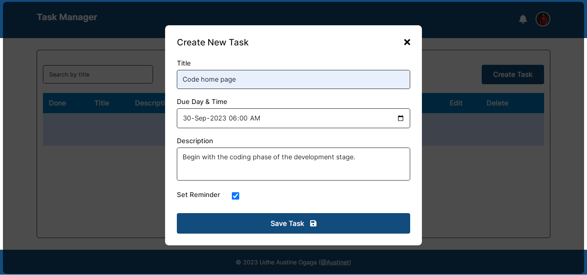
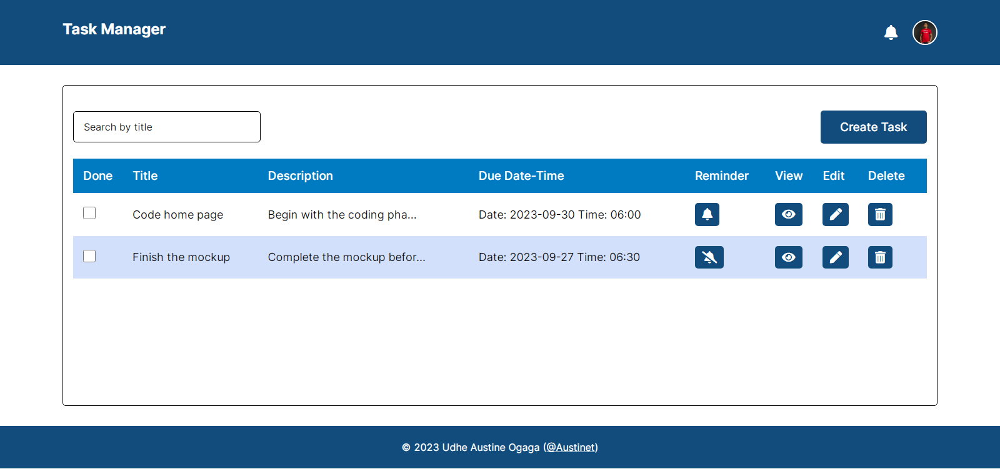
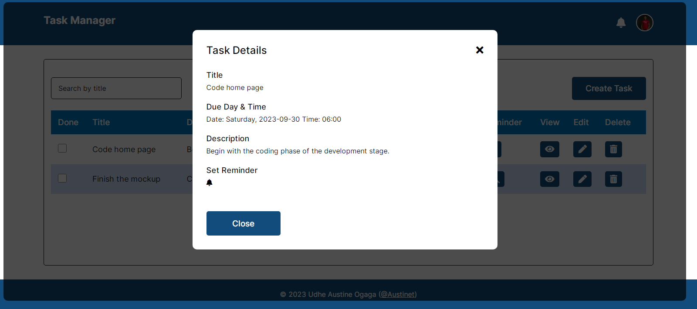
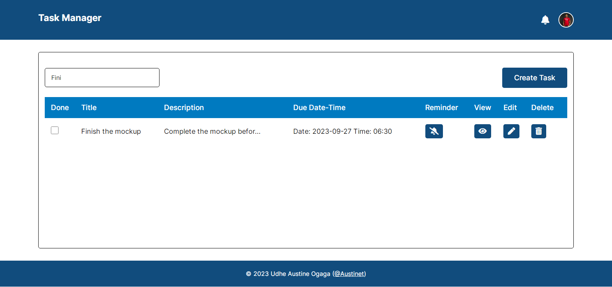
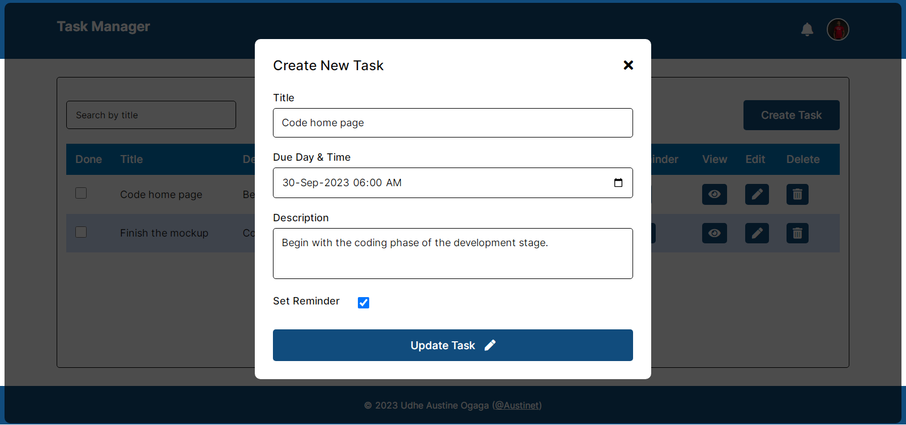

# KodeCamp - Task Manager App

## Table of contents

- [Overview](#overview)
  - [Screenshot](#screenshot)
  - [Links](#links)
- [My process](#my-process)
  - [Built with](#built-with)
  - [What I learned](#what-i-learned)
  - [Continued development](#continued-development)
  - [Useful resources](#useful-resources)
- [Author](#author)
- [Acknowledgments](#acknowledgments)

## Overview

Create a task management app with the following features
- Display a list of tasks with their names and due date
- Ability to add a new task with a name and due date
- Show an empty state when there is no task
- Ability to delete tasks
- Use useReducer hook

### Screenshot
- No Tasks
- 
- Create tasks
- 
- Tasks
- 
- View task
- 
- Search task
- 
- Edit tasks
- 
- Small Screen
- 

### Links
- [Solution URL](https://github.com/Austinet/task-manager-app.git)
- [Live site URL](https://austinet.github.io/task-manager-app/)

## My process

### Built with

- ReactJs
- CSS custom properties
- Flexbox
- Desktop-first workflow
- vite

### What I learned

I was able to practice my new Reactjs super powers developing the Task Manager App

### Continued development

Keep up with ReactJs

### Useful resources

- [ Youtube](https://www.Youtube.com)
- [Google  ](https://www.Google.com) 

## Author

- Website - [Udhe Austine Ogaga](https://Austinet.github.io/portfolio)
- Frontend Mentor - [@austinet](https://www.frontendmentor.io/profile/austinet)
- Twitter - [@austineudhe](https://www.twitter.com/austineudhe)

## Acknowledgments

I will like to acknowledge God for giving me the grace to be patient with myself while going through the huddles of carrying out this project, and KodeCamp team for this tasks where i got to develop a Task Manager App.
